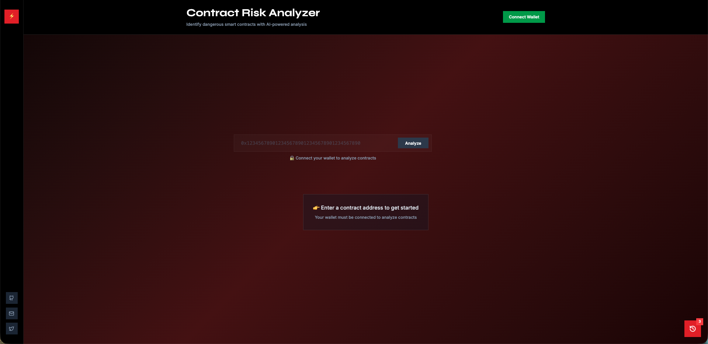
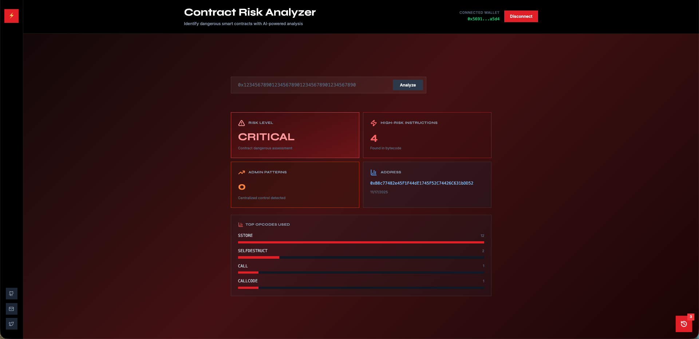
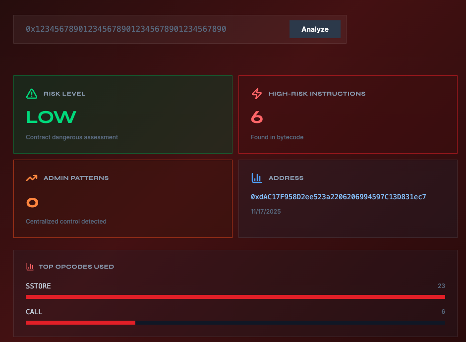

# Web3 Security Platform

An end‑to‑end smart‑contract security platform that ingests contract addresses, analyzes EVM bytecode, and surfaces actionable risk insights through a React dashboard. The stack combines an Express API, a Kafka‑driven worker, MongoDB/Redis persistence, and a Vite SPA so analysts can submit, track, and review contract scans in real time.

---

## Table of Contents

1. [Key Features](#key-features)
2. [System Architecture](#system-architecture)
3. [Tech Stack](#tech-stack)
4. [Repo Layout](#repo-layout)
5. [Prerequisites](#prerequisites)
6. [Configuration](#configuration)
7. [Running Locally](#running-locally)
8. [Running with Docker](#running-with-docker)
9. [Frontend Workflow](#frontend-workflow)
10. [API Overview](#api-overview)
11. [Testing & Quality](#testing--quality)
12. [Troubleshooting](#troubleshooting)
13. [Roadmap Ideas](#roadmap-ideas)

---

## Key Features

- **Bytecode heuristics** – Detects opcode hotspots (e.g., `DELEGATECALL`, `SELFDESTRUCT`, `CALLCODE`) and surfaces ABI admin patterns and financial control functions.
- **Async pipeline** – `POST /contracts` enqueues scans on Kafka; a worker consumes jobs, fetches bytecode/balances, runs analysis, and persists results.
- **Historical intelligence** – MongoDB stores contracts, scans, and derived metrics, enabling the frontend to visualize previous submissions instantly.
- **Shared caching** – Redis caches bytecode and completed scan reports to minimize RPC requests and accelerate repeated lookups.
- **Docker-first** – Single `docker-compose.yml` spins up MongoDB, Redis, Kafka, Express API, worker, and Vite frontend, making the entire platform reproducible.
- **Type-safe & observable** – TypeScript across services, Zod validation at the edges, structured logging, and graceful shutdown hooks.

---

## System Architecture

```
┌─────────┐     ┌────────────┐     ┌──────────┐
│ Frontend│────▶│ Express API │────▶│ MongoDB  │
└─────────┘     └────┬───────┘     └──────────┘
                      │   ▲
         Kafka Topic  │   │ latest scan + metadata
                      ▼   │
                 ┌─────────────┐
                 │ Worker (TS) │─────▶ Redis cache
                 └────┬────────┘
                      │ Bytecode + balance
                      ▼
                 Ethereum RPC
```

- **Frontend** – Vite/React SPA with wallet-aware CTA, scan history drawer, and real-time polling via `/scans/:id`.
- **API** – Validates requests, normalizes addresses, persists contracts, exposes dashboard metrics, and enqueues scan jobs.
- **Worker** – Consumes Kafka jobs, fetches bytecode/balance from the configured RPC, runs heuristics (`src/services/analysis/bytecodeAnalyzer.ts`), caches results, and updates Mongo/Redis.

---

## DEMO

### Homepage



### BNB Token



### USDT



## Tech Stack

| Layer    | Technology                                             |
| -------- | ------------------------------------------------------ |
| Frontend | React 18, Vite, Tailwind, Radix UI, TanStack Query     |
| Backend  | Node 22, Express 5, Zod, Pino, MongoDB via Mongoose    |
| Async    | KafkaJS, worker service (TypeScript)                   |
| Cache    | Redis                                                  |
| DevOps   | Docker, docker-compose, Kubernetes manifests (k8s/)    |
| Tooling  | TypeScript, SWC, Vitest, ESLint/Prettier (via scripts) |

---

## Repo Layout

```
.
├── backend/                # API + worker source (TypeScript)
├── frontend/               # Vite SPA
├── k8s/                    # Kubernetes manifests
├── docker-compose.yml      # Full development stack
├── Dockerfile              # Backend image
├── frontend/Dockerfile     # Frontend image
└── README.md
```

> Legacy paths (`src/`) are re-exported through `backend/` for clarity. Adjust imports accordingly.

---

## Prerequisites

- Node.js 22.x (API/worker) and pnpm 10.x (frontend)
- Docker Desktop (Compose v2) if running containers
- Access to an Ethereum RPC endpoint (Infura, Alchemy, local geth, etc.)
- Kafka, MongoDB, and Redis when running without Docker (Compose provides managed instances)

---

## Configuration

Create `.env` in the repo root (or export variables) with at least:

| Variable            | Description                              | Default                         |
| ------------------- | ---------------------------------------- | ------------------------------- |
| `PORT`              | API port                                 | `3000`                          |
| `RPC_URL`           | Ethereum RPC endpoint                    | _required_                      |
| `MONGO_URI`         | MongoDB connection string                | `mongodb://localhost:27017/...` |
| `REDIS_URL`         | Redis connection string                  | `redis://localhost:6379`        |
| `KAFKA_BROKERS`     | Comma-separated broker list              | `localhost:9092`                |
| `KAFKA_TOPIC`       | Kafka topic for scan jobs                | `contract-scan-requests`        |
| `KAFKA_CLIENT_ID`   | Kafka client identifier for each service | `web3-security-service`         |
| `CACHE_TTL_SECONDS` | Cache duration for scan reports (Redis)  | `600`                           |

Frontend overrides:

| Variable            | Location              | Purpose                                    |
| ------------------- | --------------------- | ------------------------------------------ |
| `BACKEND_URL`       | `frontend/Dockerfile` | Development proxy target inside container  |
| `VITE_API_BASE_URL` | Frontend runtime      | Override `/api` base path when not proxied |

---

## Running Locally

1. **Install backend deps**

   ```bash
   npm install
   ```

2. **Install frontend deps**

   ```bash
   cd frontend
   pnpm install
   ```

3. **Start backing services** (Mongo/Redis/Kafka). Use Docker (recommended) or local installs.

4. **Run the API**

   ```bash
   npm run dev
   ```

5. **Run the worker in another terminal**

   ```bash
   npm run worker
   ```

6. **Run the frontend**
   ```bash
   cd frontend
   BACKEND_URL=http://localhost:3000 pnpm dev
   ```

Visit `http://localhost:8080`, connect a wallet (MetaMask), enter a contract address, and watch the analysis pipeline complete and populate history.

---

## Running with Docker

The Compose stack launches every dependency, including the frontend proxy:

```bash
docker compose up --build
```

Services:

| Service  | Port  | Notes                                           |
| -------- | ----- | ----------------------------------------------- |
| frontend | 8080  | Vite dev server + Express proxy (`BACKEND_URL`) |
| api      | 3000  | REST API                                        |
| worker   | —     | Kafka consumer (logs only)                      |
| mongo    | 27017 | MongoDB                                         |
| redis    | 6379  | Redis                                           |
| kafka    | 9092  | Kafka (with Zookeeper sidecar)                  |

> `kafka` is exposed internally via the hostname `kafka`. Ensure Docker is running with sufficient permissions before calling `docker compose`.

---

## Frontend Workflow

- `/client/pages/Index.tsx` orchestrates wallet connection, submission, and polling using helpers from `client/lib/api.ts`.
- Contract submissions call `POST /contracts`, which enqueues a scan; the UI polls `GET /scans/:id` until the status becomes `succeeded` or `failed`.
- History drawer fetches `GET /contracts?limit=50` to render previous analyses from MongoDB.
- Vite config proxies `/api` to the backend in dev; for production builds, `frontend/server/node-build.ts` serves the SPA and forwards `/api` to the actual API URL.

---

## API Overview

| Endpoint                    | Method | Description                                                 |
| --------------------------- | ------ | ----------------------------------------------------------- |
| `/health`                   | GET    | Service status                                              |
| `/contracts`                | GET    | List contracts (filters: `riskLevel`, `network`, paging)    |
| `/contracts`                | POST   | Register contract & optionally enqueue scan (`enqueueScan`) |
| `/contracts/:address`       | GET    | Fetch contract + latest scan                                |
| `/contracts/:address/scans` | GET    | Contract scan history                                       |
| `/contracts/:address/scan`  | POST   | Enqueue a scan via path param                               |
| `/scans`                    | GET    | Paginated scan listing (filter by `status`)                 |
| `/scans/:scanId`            | GET    | Fetch a single scan / cached report                         |
| `/dashboard/stats`          | GET    | Aggregated metrics                                          |
| `/chain/block`              | GET    | Latest block from RPC                                       |
| `/chain/contracts/:address` | GET    | Live on-chain balance/bytecode snapshot                     |

Payloads and schemas live under `backend/routes/**` with Zod validation.

---

## Testing & Quality

| Command                           | Scope               |
| --------------------------------- | ------------------- |
| `npm run test`                    | Backend tests       |
| `npm run build` / `npm run start` | Production build    |
| `cd frontend && pnpm test`        | Vitest suite        |
| `cd frontend && pnpm typecheck`   | TS type checking    |
| `cd frontend && pnpm format.fix`  | Prettier formatting |

CI/CD is not bundled, but the repo is structured for quick integration with GitHub Actions/GitLab CI.

---

## Troubleshooting

| Symptom                                            | Fix                                                                                                                        |
| -------------------------------------------------- | -------------------------------------------------------------------------------------------------------------------------- |
| `KafkaJSNumberOfRetriesExceeded`                   | Ensure Docker is running; confirm `kafka` container is healthy and accessible via hostname `kafka` on the Compose network. |
| Frontend shows “Analysis failed – route not found” | Verify frontend proxy is pointing to the API (`BACKEND_URL`/`VITE_API_BASE_URL`). Restart Vite after editing `.env`.       |
| Wallet connect button disabled                     | Ensure MetaMask (or equivalent) injects `window.ethereum`. For local demos you can stub addresses in `useWalletAuth`.      |
| Mongo `metadata` conflict                          | Already patched – ensure backend image is rebuilt so `$set` vs `$setOnInsert` logic is updated.                            |
| Compose cannot connect to Docker socket            | Run Docker Desktop with sufficient permissions or execute commands with elevated privileges.                               |

---

## Roadmap Ideas

1. **Advanced heuristics** – Integrate symbolic execution or external scanners for deeper analysis.
2. **Notification layer** – Webhooks or email alerts when high-risk scans complete.
3. **Metrics/observability** – Prometheus + Grafana dashboards for queue depth, scan latency, error budgets.
4. **Role-based access** – Multi-user auth for restricting dashboard visibility/actions.
5. **Signature enrichment** – Integrate 4byte.directory or Sourcify to enhance ABI insights.

---

## License

This project is distributed under the MIT License. Review `LICENSE` (add if missing) before distributing builds.

---

Need help or stuck on a deployment? Open an issue with logs, environment details, and reproduction steps—we’re happy to assist. Happy auditing! 🛡️
